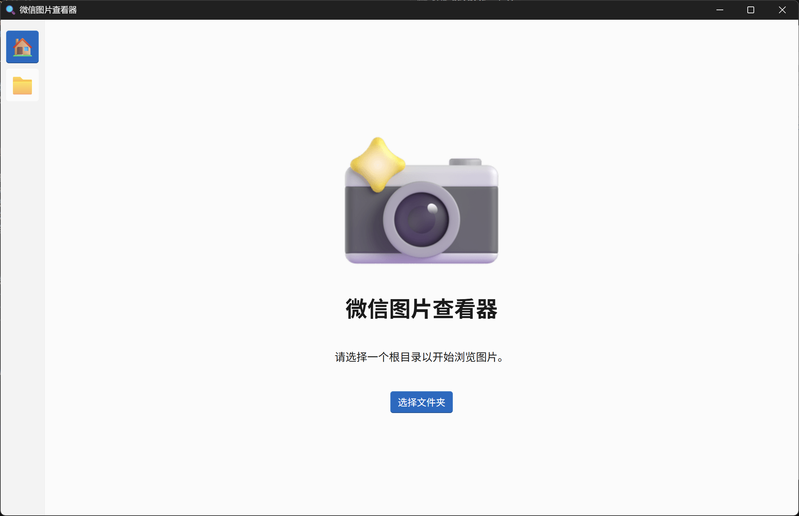

# 微信图片查看器

> 一个用于查看和解密微信图片文件的工具
> 
> 本项目仅供学习交流使用，**可能存在封号风险，请勿用于非法用途**，否则后果自负。

## 功能简介

- 图形化界面，操作简单直观
- 将微信缓存的 `.dat` 文件解密为原始图片格式。
- 支持微信 3.x 和 4.x 多种加密版本。
- 实时预览解密后的图片
- 自动检测和保存解密密钥

## 特性

- 支持多个微信版本解密：
  - 微信 3.x 加密格式
  - 微信 4.0.0 加密格式
  - 微信 4.0.3+ 新加密格式

## 系统要求

- Windows 11
- Python 3.12

## 使用方法

1. 使用 `app.py` 文件，或者从 [Releases](https://github.com/recarto404/WxDatDecrypt/releases) 页面下载预编译的二进制文件。
2. 在程序界面中点击选择文件夹按钮，选择微信的图片缓存目录
3. 程序会自动扫描目录并显示所有可用的图片文件
4. 点击左侧目录树可以浏览不同文件夹

## 密钥缓存

程序会自动在当前目录下创建 `config.json` 文件，用于存储解密所需的密钥信息。

## 注意事项

- 对于 `wxgf` 格式微信图片的解码, **暂时只提供 [Releases](https://github.com/recarto404/WxDatDecrypt/releases) 的分支**

## 许可证

本项目采用 [MIT License](./LICENSE) 开源协议。

## 技术支持

如有问题或建议，请提交 Issue。

## 感谢

- [Fluent Emoji](https://github.com/microsoft/fluentui-emoji)
- [Fluent UI Web Components](https://github.com/microsoft/fluentui/tree/master/packages/web-components)